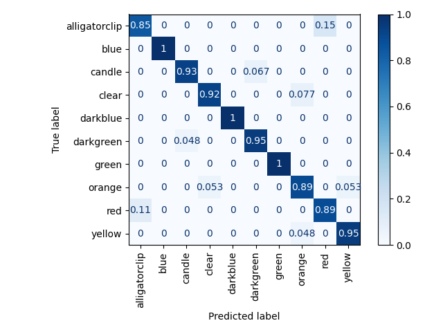
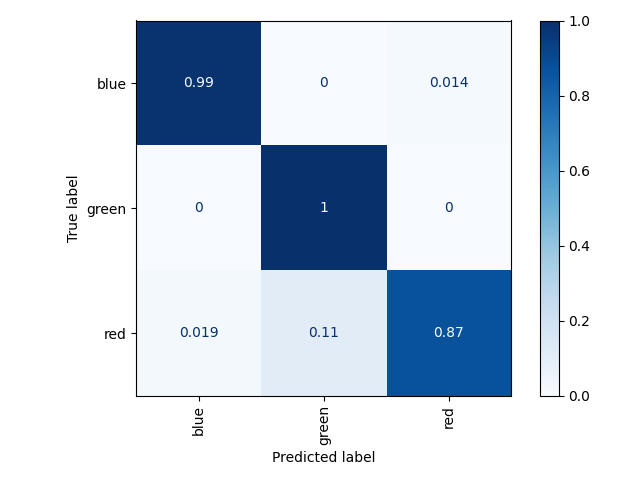
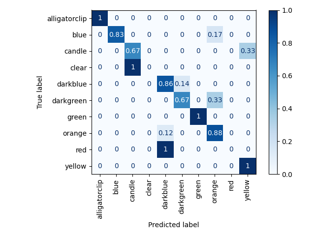
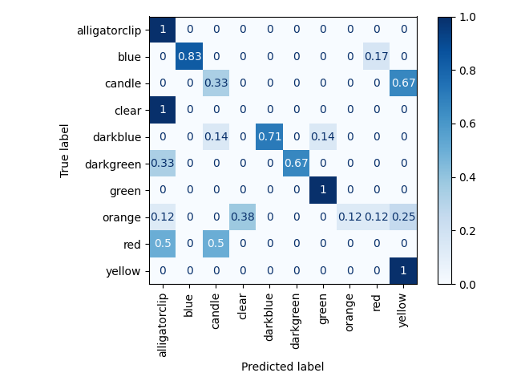

#AI Through Symbiosis

----------------------

Code repo for AI Through Symbiosis project, accepted for publication by Ambient AI: Multimodal Wearable Sensor Understanding workshop at ICASSP 2023.

Keep track of this repo as we plan to release our picklist video dataset soon!

## <ins>Quickstart</ins>

For a quickstart, you can download the intermediate outputs generated from our dataset and change the config paths to match

## <ins>Playing around</ins>

### Extracting features from video

Running extract_features.py script to extract features from the videos
``` 
# run from ai-through-symbiosis root directory 
python3 extract_features.py -v <path to video file>
```

To visualize features that are being detected (e.g. ArUco markers, hand locations), set `DISPLAY_TRUE` in 
extract_features.py script to `True`

Next, preprocess the data by running the ```scripts/data_preprocessing/forward_fill.py``` and ```scripts/data_preprocessing/gaussian_convolution.py```
scripts. Create a config file by copying ```scripts/configs/base.yaml``` and filling in the appropriate paths to folders in your local environment.

Change the 

### Training HMMs

(In development)

### Extracting pick labels for pick sequences


## <ins> Results </ins>


Train set results from clustering (i.e. accuracy of matching labels to pick frame sequences in the train set), which is used to
label the weakly supervised action sets and obtain object representations


Test set results on three object test set (restricting output predictions to three objects):


Test set results on ten object test set (constrained to set of objects that appeared in the picklist):


Test set results on ten object test set (unconstrained):



[//]: # (## <ins> Contribute! </ins>)

[//]: # ()
[//]: # (If you find our work helpful, consider contributing )